# College Event Attendance System - StarUML Mermaid-Compatible Pack

This pack is adjusted to match StarUML Mermaid support constraints.
Supported diagram types used here are: classDiagram, sequenceDiagram, stateDiagram-v2, flowchart, erDiagram, requirementDiagram, and mindmap.

## 1. Use Case Diagram (flowchart representation)

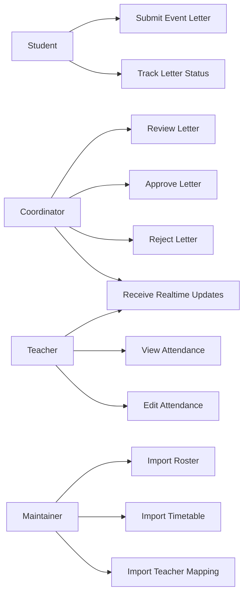

## 2. Class Diagram

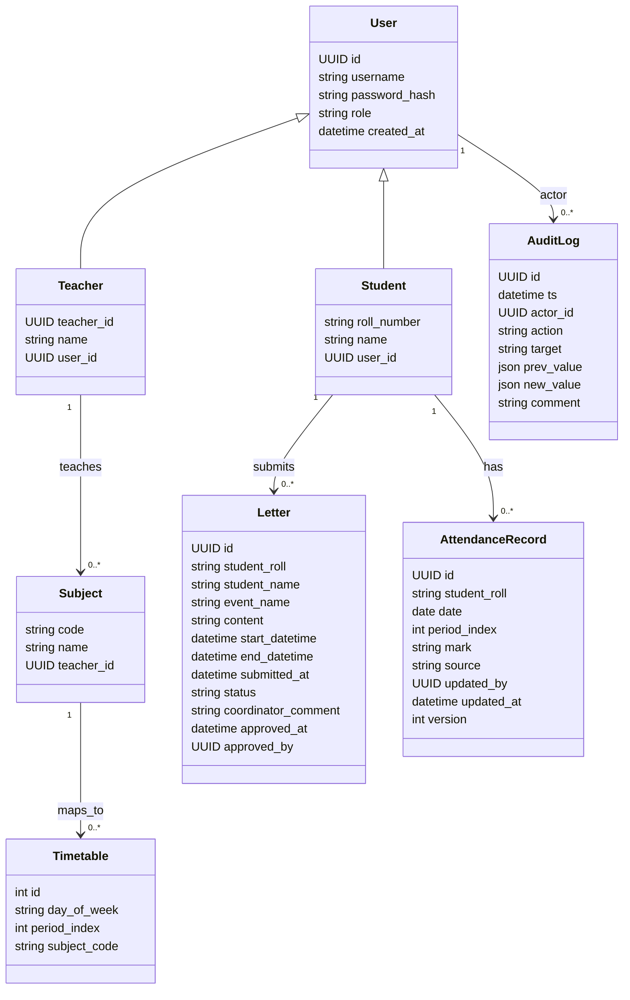

## 3. Sequence Diagram

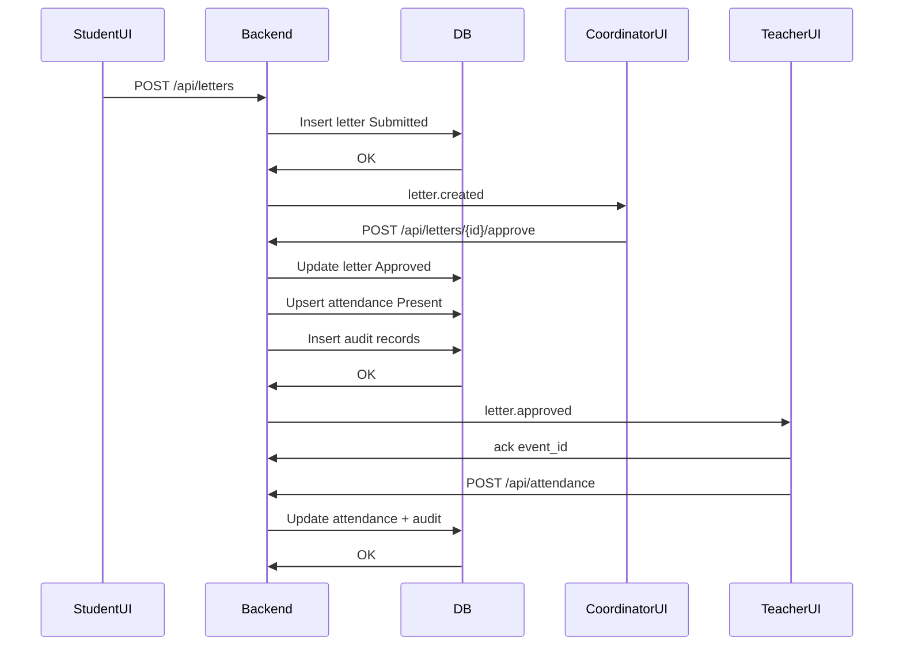

## 4. Statechart Diagram

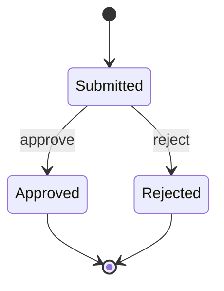

## 5. Activity Diagram (flowchart representation)

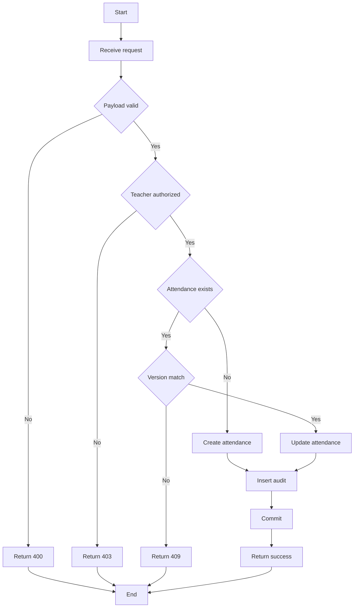

## 6. Package Diagram (flowchart representation)

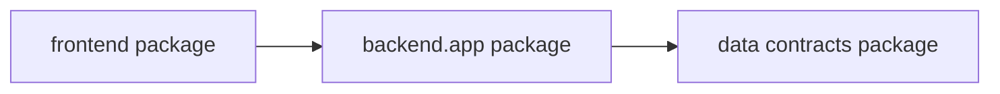

## 7. Component Diagram (flowchart representation)

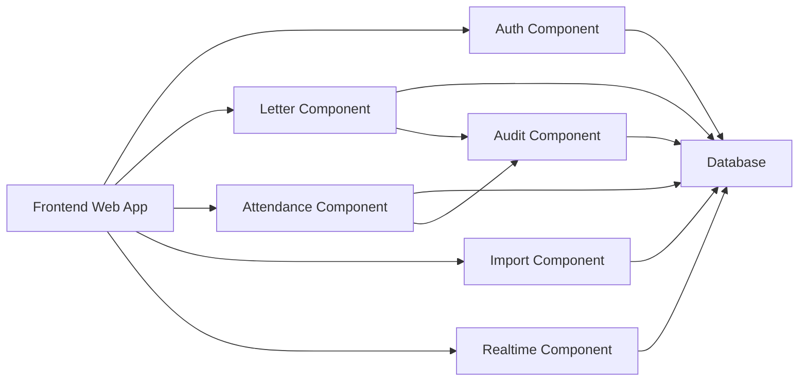

## 8. Deployment Diagram (flowchart representation)

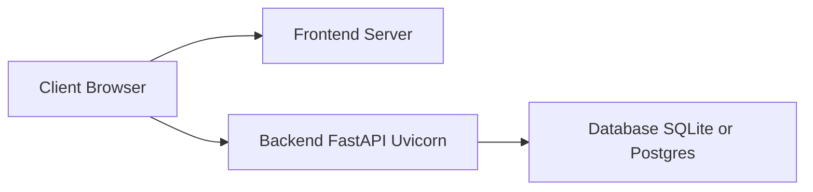

## 9. Object Diagram (classDiagram instance style)

```mermaid
classDiagram
  class "studentA:Student" as studentA {
    string roll_number
    string name
  }

  class "letterL1:Letter" as letterL1 {
    string id
    string status
    string event_name
  }

  class "attP3:AttendanceRecord" as attP3 {
    date date
    int period_index
    string mark
    string source
  }

  class "coordU:User" as coordU {
    string username
    string role
  }

  studentA --> letterL1 : submitted
  coordU --> letterL1 : approved_by
  letterL1 --> attP3 : affects
```

## 10. Interaction Overview Diagram (flowchart representation)

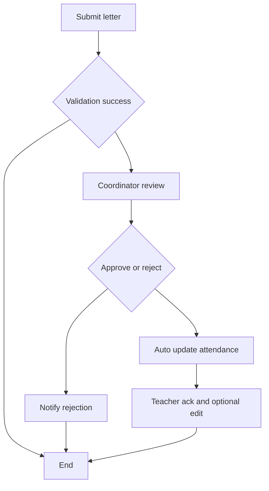

## 11. Communication Diagram (flowchart representation)

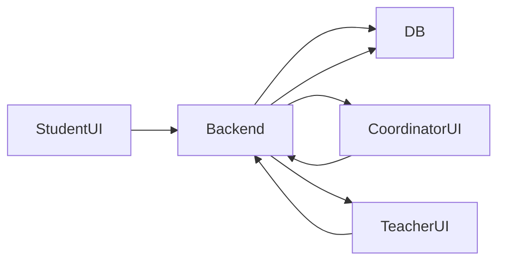

## 12. Entity Relationship Diagram

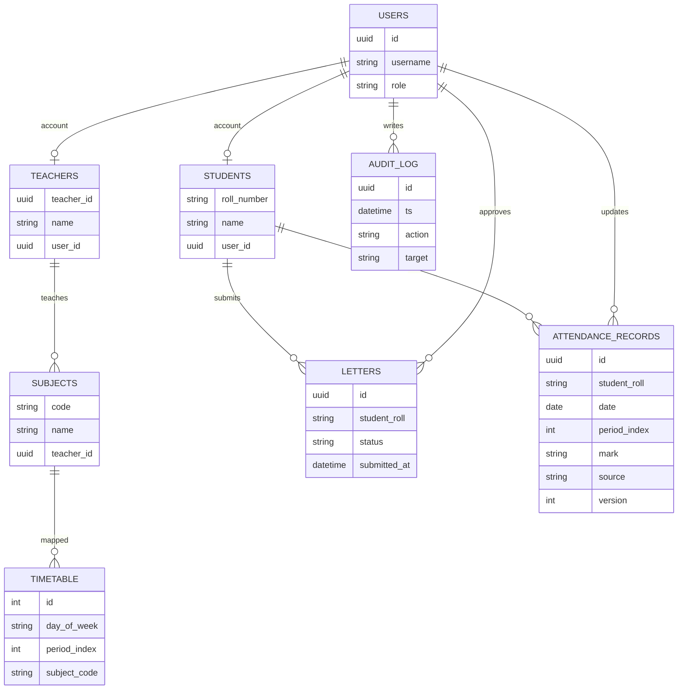

## 13. Requirement Diagram

```mermaid
requirementDiagram
  requirement FR_01 {
    id: FR-01
    text: Import roster CSV and create student records.
    risk: medium
    verifymethod: test
  }

  requirement FR_08 {
    id: FR-08
    text: Coordinator can approve or reject letters.
    risk: high
    verifymethod: test
  }

  requirement FR_10 {
    id: FR-10
    text: Attendance is prefilled for approved events.
    risk: high
    verifymethod: test
  }

  element BackendService {
    type: software
  }

  BackendService - satisfies -> FR_01
  BackendService - satisfies -> FR_08
  BackendService - satisfies -> FR_10
```

## 14. Mindmap

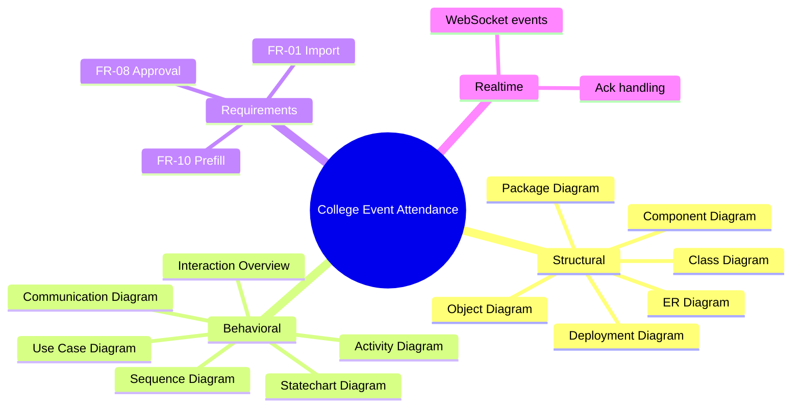

## 15. System Context Diagram (additional)

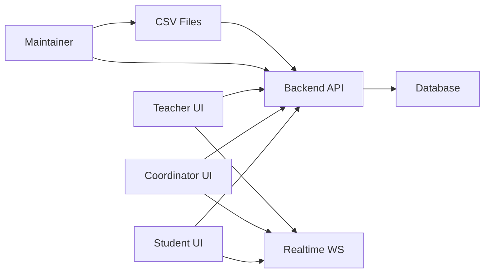
